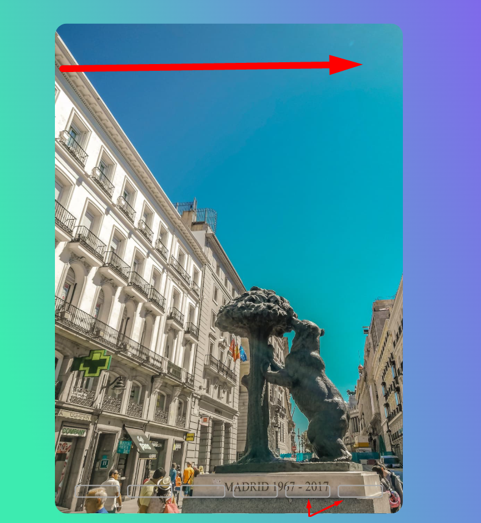
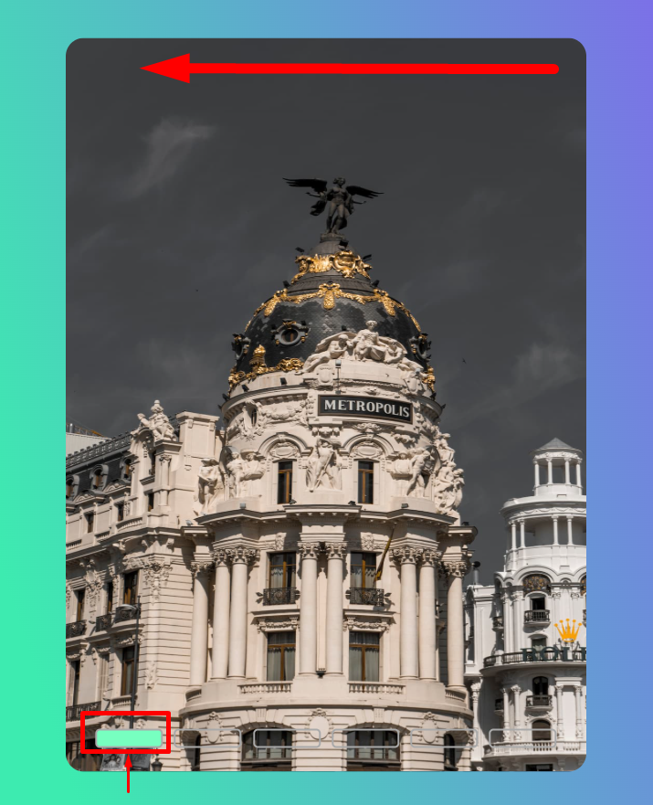

# Sobre este projeto:
Trata-se de um projeto simples de carrosel de imagens.
Contendo pequenas a notações comentadas no codigo.

## Pagina de Carrocel:
O usuario navegara pelas imagens do corrocel.

## Funcinamento:
O usuario navegara pelas imagens do corrocel, da primeira imagem a ultima da esquerda clicando nos inputs.

## Apresentacao:
Tambem poderá navegara pelas imagens do corrocel, aleatoriamente clicando nos inputs.

